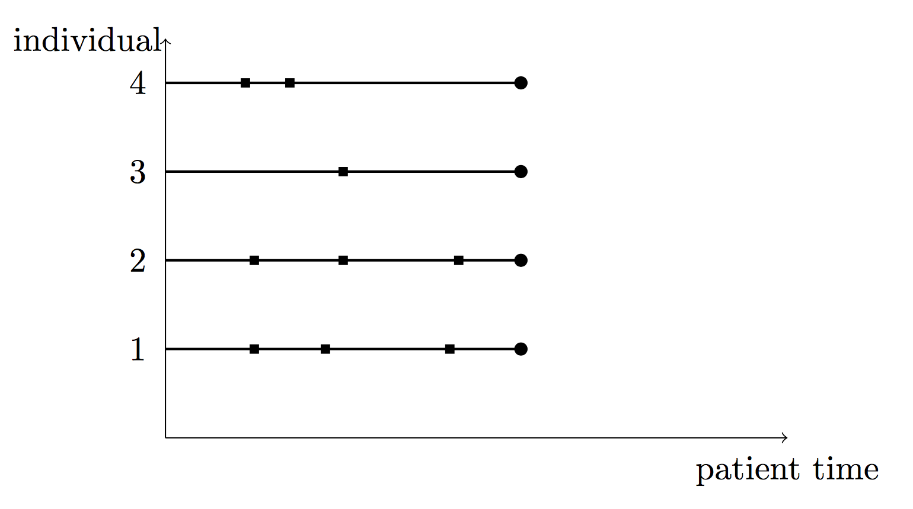
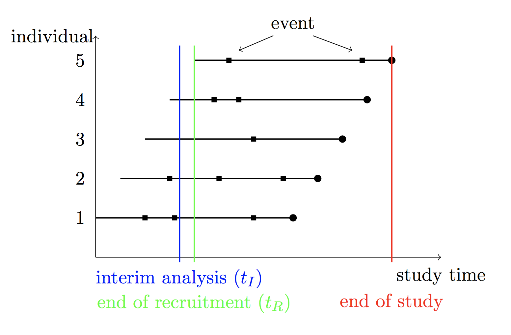

```{r setup, include=FALSE, cache=FALSE}
library(knitr)
opts_chunk$set(
  fig.align = 'center', 
  fig.show = 'asis', 
  eval = TRUE,
  fig.width = 6,
  fig.height = 6,
  message = FALSE,
  size = 'small',
  comment = '##',
  prompt = FALSE,
  echo = TRUE, # set to true for the vignette!
  results = 'hold',
  tidy = FALSE)

options(replace.assign=TRUE,
        width=90
        # prompt="R> "
        )
```

# Abstract {-}

`simrec` allows simulation of recurrent event data following the multiplicative intensity model described in [@Andersen1982] with the baseline hazard being a function of the total/calendar time. 
To induce between-subject-heterogeneity a random effect covariate (frailty term) can be incorporated. 
Furthermore, via `simreccomp` simulation of data following a multistate model with recurrent event data of one type and a competing event is possible. 
`simrecint` gives the possibility to additionally simulate a recruitment time for each individual and cut the data to an interim data set. 
With `simrecPlot` and `simreccompPlot` the data can be plotted.

**Keywords**: recurrent event data, competing event, frailty, simulation, total-time model

<!-- \usepackage{amsmath, amssymb} -->
<!-- \usepackage{tikz} -->

<!-- %% Note that you should use the \pkg{}, \proglang{} and \code{} commands. -->


# Introduction 
<!-- {#sec:intro} -->

The `simrec` package includes the functions `simrec`, `simreccomp` and `simrecint` and allows simulation of recurrent event data. 
To induce between-subject-heterogeneity a random effect covariate (frailty term) can be incorporated. 
Via `simreccomp` time-to-event data that follow a multistate model with recurrent event data of one type and a competing event can be simulated. 
Data output is in the counting-process format. 
`simrecint` gives the possibility to additionally simulate a recruitment time for each individual and cut the data to an interim data set. 
With `simrecPlot` and `simreccompPlot` the data can be plotted.


# The `simrec` function 

## Description {-}

The function `simrec` allows simulation of recurrent event data following the multiplicative intensity model described in Andersen and Gill [@Andersen1982] with the baseline hazard being a function of the total/calendar time. 
To induce between-subject-heterogeneity a random effect covariate (frailty term) can be incorporated. 
Data for individual $i$ are generated according to the intensity process 
$$Y_i(t)\cdot \lambda_0(t)\cdot Z_i \cdot \exp(\beta^t X_i)$$
where $X_i$ defines the covariate vector, and $\beta$ the regression coefficient vector.
$\lambda_0(t)$ denotes the baseline hazard, being a function of the total/calendar time $t$, and $Y_i(t)$ the predictable process that equals one as long as individual $i$ is under observation and at risk for experiencing events.
$Z_i$ denotes the frailty variable with $(Z_i)_i$ iid with $E(Z_i)=1$ and $Var(Z_i)=\theta$. The parameter $\theta$ describes the degree of between-subject-heterogeneity. 
Data output is in the counting process format.

```{r codeExample,echo=TRUE,eval=FALSE}
simrec(N, fu.min, fu.max, cens.prob = 0, dist.x = "binomial", par.x = 0,
  beta.x = 0, dist.z = "gamma", par.z = 0, dist.rec, par.rec, pfree = 0,
  dfree = 0)
```


## Parameters {-}

- `N` Number of individuals
- `fu.min` Minimum length of follow-up.
- `fu.max` Maximum length of follow-up. Individuals length of follow-up is generated from a uniform distribution on `[fu.min, fu.max]`. If `fu.min=fu.max`, then all individuals have a common follow-up.
- `cens.prob` Gives the probability of being censored due to loss to follow-up before `fu.max`. For a random set of individuals defined by a B(N,`cens.prob`)-distribution, the time to censoring is generated from a uniform distribution on `[0, fu.max]`. Default is `cens.prob=0`, i.e. no censoring due to loss to follow-up.
-  `dist.x` Distribution of the covariate(s) $X$. If there is more than one covariate,
`dist.x` must be a vector of distributions with one entry for each covariate. Possible
values are `"binomial"` and `"normal"`, default is `"binomial"`.
- `par.x` Parameters of the covariate distribution(s). For `"binomial"`, `par.x` is the probability for $x=1$. For `"normal"`, `par.x` is the vector of ($\mu, \sigma$)} where $\mu$ is the mean and $\sigma$ is the standard deviation of a normal distribution. 
  If one of the covariates is defined to be normally distributed, `par.x` must be a list, e.g. `dist.x <- c("binomial", "normal")` and `par.x  <- list(0.5, c(1,2))`. Default is `par.x = 0`, i.e. $x=0$ for all individuals.
- `beta.x` Regression coefficient(s) for the covariate(s) $x$. If there is more than one covariate, `beta.x` must be a vector of coefficients with one entry for each covariate. `simrec` generates as many covariates as there are entries in `beta.x`. Default is `beta.x = 0`, corresponding to no effect of the covariate $x$.
- `dist.z` Distribution of the frailty variable $Z$ with $E(Z)=1$ and $Var(Z)=\theta$. Possible values are `"gamma"` for a Gamma distributed frailty and `"lognormal"` for a lognormal distributed frailty. Default is `dist.z="gamma"`.
- `par.z` Parameter $\theta$ for the frailty distribution: this parameter gives the variance of the frailty variable $Z$. Default is `par.z=0`, which causes $Z\equiv 1$, i.e. no frailty effect.
- `dist.rec` Form of the baseline hazard function. Possible values are `"weibull"` or `"gompertz"` or `"lognormal"`  or `"step"`.
- `par.rec` Parameters for the distribution of the event data. <br>
  If `dist.rec="weibull"` the  hazard function is
  $$\lambda_0(t)=\lambda\cdot\nu\cdot t^{\nu - 1}$$
  where $\lambda>0$ is the scale and $\nu>0$ is the shape parameter. Then `par.rec=c(lambda, nu)`. A special case of this is the exponential distribution for $\nu=1$.\\
  If `dist.rec="gompertz"`, the hazard function is
  $$\lambda_0(t)=\lambda\cdot \exp(\alpha t)$$
  where $\lambda>0$ is the scale and $\alpha\in(-\infty,+\infty)$ is the shape parameter. Then `par.rec=c(lambda, alpha)`. <br>
  If `dist.rec="lognormal"`, the hazard function is
  $$\lambda_0(t) = \frac{1}{\sigma t} \cdot \frac{\phi(\frac{ln(t)-\mu}{\sigma})}{\Phi(\frac{-ln(t)-\mu}{\sigma})}$$
  where $\phi$ is the probability density function and $\Phi$ is the cumulative distribution function of the standard normal distribution, $\mu\in(-\infty,+\infty)$ is a location parameter and $\sigma>0$ is a shape parameter. Then `par.rec=c(mu,sigma)`. 
  Please note that specifying `dist.rec="lognormal"` together with some covariates does not specify the usual lognormal model (with covariates specified as effects on the parameters of the lognormal distribution resulting in non-proportional hazards), but only defines the baseline hazard and incorporates covariate effects using the proportional hazard assumption. <br>
  If `dist.rec="step"` the hazard function is 
  $$\lambda_0(t)=\begin{cases} a, & t\leq t_1\cr b, & t>t_1\end{cases}$$
  Then `par.rec=c(a,b,t_1)`, with $a,b\geq 0$.

- `pfree` Probability that after experiencing an event the individual is not at risk for experiencing further events for a length of `dfree` time units. Default is `pfree = 0`.
- `dfree` Length of the risk-free interval. Must be in the same time unit as `fu.max`. Default is `dfree = 0`, i.e. the individual is continously at risk for experiencing events until end of follow-up.


## Output {-}

The output is a `data.frame` consisting of the columns:

- `id` An integer number for identification of each individual
- `x` or `x.V1, x.V2, ...` - depending on the covariate matrix. Contains the randomly generated value of the covariate(s) $X$ for each individual.
- `z` Contains the randomly generated value of the frailty variable $Z$ for each individual.
- `start` The start of interval `[start, stop]`, when the individual starts to be at risk for a next event.
- `stop` The time of an event or censoring, i.e. the end of interval `[start, stop]`.
- `status` An indicator of whether an event occured at time `stop` (`status=1`) or the individual is censored at time `stop` (`status=0`).
- `fu` Length of follow-up period `[0,fu]` for each individual.

For each individual there are as many lines as it experiences events, plus one line if being censored. 
The data format corresponds to the counting process format.

## Details {-}

Data are simulated by extending the methods proposed by Bender [@Bender2005] to the multiplicative intensity model.
You can read more on this in our work [@Jahn-Eimermacher2015].

## Example {-}

```{r Examplesimrec}
library(simrec)
### Example:
### A sample of 10 individuals

N <- 10

### with a binomially distributed covariate with a regression coefficient
### of beta=0.3, and a standard normally distributed covariate with a
### regression coefficient of beta=0.2,

dist.x <- c("binomial", "normal")
par.x  <- list(0.5, c(0,1))
beta.x <- c(0.3, 0.2)

### a gamma distributed frailty variable with variance 0.25

dist.z <- "gamma"
par.z  <- 0.25

### and a Weibull-shaped baseline hazard with shape parameter lambda=1
### and scale parameter nu=2.

dist.rec <- "weibull"
par.rec  <- c(1,2)

### Subjects are to be followed for two years with 20\% of the subjects
### being censored according to a uniformly distributed censoring time
### within [0,2] (in years).

fu.min    <- 2
fu.max    <- 2
cens.prob <- 0.2

### After each event a subject is not at risk for experiencing further events
### for a period of 30 days with a probability of 50\%.

dfree <- 30/365
pfree <- 0.5

simdata <- simrec(N, fu.min, fu.max, cens.prob, dist.x, par.x, beta.x,
                  dist.z, par.z, dist.rec, par.rec, pfree, dfree)
print(simdata[1:10,])
DT::datatable(simdata)
```


# The `simreccomp` function

## Description {-}

The function `simreccomp` allows simulation of time-to-event-data that follow a multistate-model with recurrent events of one type and a competing event. 
The baseline hazard for the cause-specific hazards are here functions of the total/calendar time.
To induce between-subject-heterogeneity a random effect covariate (frailty term) can be incorporated for the recurrent and the competing event.

Data for the recurrent events of the individual $i$ are generated according to the cause-specific hazards
$$\lambda_{0r}(t)\cdot Z_{ri} \cdot \exp(\beta_r^t X_i)$$
where $X_i$ defines the covariate vector and $\beta_r$ the regression coefficient vector.
$\lambda_{0r}(t)$ denotes the baseline hazard, being a function of the total/calendar time $t$ and $Z_{ri}$ denotes the frailty variables with $(Z_{ri})_i$ iid with $E(Z_{ri})=1$ and $Var(Z_{ri})=\theta_r$. 
The parameter $\theta_r$ describes the degree of between-subject-heterogeneity for the recurrent event.
Analougously the competing event is generated according to the cause-specific hazard conditionally on the frailty variable and covariates: 
$$\lambda_{0c}(t)\cdot Z_{ci} \cdot \exp(\beta_c^t X_i)$$
Data output is in the counting process format.

```{r codeExamplecomp,echo=TRUE,eval=FALSE}
simreccomp(N, fu.min, fu.max, cens.prob=0, dist.x="binomial", par.x=0,
           beta.xr=0, beta.xc=0, dist.zr="gamma", par.zr=0, a=NULL,
           dist.zc=NULL, par.zc=NULL, dist.rec, par.rec,
           dist.comp, par.comp, pfree=0, dfree=0)
```


## Parameters {-}

- `N` Number of individuals
- `fu.min` Minimum length of follow-up.
- `fu.max` Maximum length of follow-up. Individuals length of follow-up is generated from a uniform distribution on `[fu.min, fu.max]`. If `fu.min=fu.max`, then all individuals have a common follow-up.
- `cens.prob` Gives the probability of being censored due to loss to follow-up before `fu.max`. For a random set of individuals defined by a B(N,`cens.prob`)-distribution, the time to censoring is generated from a uniform distribution on `[0, fu.max]`. Default is `cens.prob=0`, i.e. no censoring due to loss to follow-up.
-  `dist.x` Distribution of the covariate(s) $X$. If there is more than one covariate,
`dist.x` must be a vector of distributions with one entry for each covariate. Possible
values are `"binomial"` and `"normal"`, default is `"binomial"`.
- `par.x` Parameters of the covariate distribution(s). For `"binomial"`, `par.x` is the probability for $x=1$. For `"normal"`, `par.x` is the vector of ($\mu, \sigma$)} where $\mu$ is the mean and $\sigma$ is the standard deviation of a normal distribution. 
  If one of the covariates is defined to be normally distributed, `par.x` must be a list, e.g. `dist.x <- c("binomial", "normal")` and `par.x  <- list(0.5, c(1,2))`. Default is `par.x = 0`, i.e. $x=0$ for all individuals.
- `beta.xr` Regression coefficient(s) for the covariate(s) $x$ corresponding to the recurrent events. 
  If there is more than one covariate, `beta.xr` must be a vector of coefficients with one entry for each covariate. `simreccomp` generates as many covariates as there are entries in `beta.xr`. Default is `beta.xr = 0`, corresponding to no effect of the covariate $x$ on the recurrent events.
- `beta.xc` Regression coefficient(s) for the covariate(s) $x$ corresponding to the competing event. 
  If there is more than one covariate, `beta.xc` must be a vector of coefficients with one entry for each covariate. `simreccomp` generates as many covariates as there are entries in `beta.xc`. Default is `beta.xc = 0`, corresponding to no effect of the covariate $x$ on the competing event.
- `dist.zr` Distribution of the frailty variable $Z_r$ for the recurrent events with $E(Z_r)=1$ and $Var(Z_r)=\theta_r$. 
  Possible values are `"gamma"` for a Gamma distributed frailty and `"lognormal"` for a lognormal distributed frailty. Default is `dist.zr="gamma"`.
- `par.zr` Parameter $\theta_r$ for the frailty distribution: this parameter gives the variance of the frailty variable $Z_r$. Default is `par.zr=0`, which causes $Z\equiv 1$, i.e. no frailty effect for the recurrent events.
- `dist.zc` Distribution of the frailty variable $Z_c$ for the competing event with $E(Z_c)=1$ and $Var(Z_c)=\theta_r$.
  Possible values are `"gamma"` for a Gamma distributed frailty and `"lognormal"` for a lognormal distributed frailty.
- `par.zc` Parameter $\theta_c$ for the frailty distribution: this parameter gives the variance of the frailty variable $Z_c$.
- `a` Alternatively, the frailty distribution for the competing event can be computed through the distribution of the frailty variable $Z_r$ by $Z_c=Z_r^a$. Either `a` or `dist.zc` and `par.zc` must be specified.
- `dist.rec` Form of the baseline hazard function for the recurrent events. Possible values are `"weibull"` or `"gompertz"` or `"lognormal"`  or `"step"`.
- `par.rec` Parameters for the distribution of the recurrent event data. <br>
  If `dist.rec="weibull"` the  hazard function is
  $$\lambda_0(t)=\lambda\cdot\nu\cdot t^{\nu - 1}$$
  where $\lambda>0$ is the scale and $\nu>0$ is the shape parameter. Then `par.rec=c(lambda, nu)`. A special case of this is the exponential distribution for $\nu=1$.\\
  If `dist.rec="gompertz"`, the hazard function is
  $$\lambda_0(t)=\lambda\cdot \exp(\alpha t)$$
  where $\lambda>0$ is the scale and $\alpha\in(-\infty,+\infty)$ is the shape parameter. Then `par.rec=c(lambda, alpha)`. <br>
  If `dist.rec="lognormal"`, the hazard function is
  $$\lambda_0(t) = \frac{1}{\sigma t} \cdot \frac{\phi(\frac{ln(t)-\mu}{\sigma})}{\Phi(\frac{-ln(t)-\mu}{\sigma})}$$
  where $\phi$ is the probability density function and $\Phi$ is the cumulative distribution function of the standard normal distribution, $\mu\in(-\infty,+\infty)$ is a location parameter and $\sigma>0$ is a shape parameter. Then `par.rec=c(mu,sigma)`. 
  Please note that specifying `dist.rec="lognormal"` together with some covariates does not specify the usual lognormal model (with covariates specified as effects on the parameters of the lognormal distribution resulting in non-proportional hazards), but only defines the baseline hazard and incorporates covariate effects using the proportional hazard assumption. <br>
  If `dist.rec="step"` the hazard function is 
  $$\lambda_0(t)=\begin{cases} a, & t\leq t_1\cr b, & t>t_1\end{cases}$$
  Then `par.rec=c(a,b,t_1)`, with $a,b\geq 0$.

- `dist.comp` Form of the baseline hazard function for the competing event. 
  Possible values are `"weibull"` or `"gompertz"` or `"lognormal"`  or `"step"`.
- `par.comp` Parameters for the distribution of the competing event data. For more details see `par.rec`.
- `pfree` Probability that after experiencing an event the individual is not at risk for experiencing further events for a length of `dfree` time units. Default is `pfree = 0`.
- `dfree` Length of the risk-free interval. Must be in the same time unit as `fu.max`. Default is `dfree = 0`, i.e. the individual is continously at risk for experiencing events until end of follow-up.

## Output {-}

The output is a `data.frame` consisting of the columns:

- `id` An integer number for identification of each individual
- `x` or `x.V1, x.V2, ...` - depending on the covariate matrix. Contains the randomly generated value of the covariate(s) $X$ for each individual.
- `zr` Contains the randomly generated value of the frailty variable $Z_r$ for each individual.
- `zc` Contains the randomly generated value of the frailty variable $Z_c$ for each individual.
- `start` The start of interval `[start, stop]`, when the individual starts to be at risk for a next event.
- `stop` The time of an event or censoring, i.e. the end of interval `[start, stop]`.
- `status` An indicator of whether an event occured at time `stop` (`status=1`) or the individual is censored at time `stop` (`status=0`) or the competing event occured at time `stop` (`status=2`).
- `fu` Length of follow-up period `[0,fu]` for each individual.

For each individual there are as many lines as it experiences events, plus one line if being censored.
The data format corresponds to the counting process format.

## Example {-}

```{r Examplesimreccomp}
library(simrec)
### Example:
### A sample of 10 individuals

N <- 10

### with a binomially distributed covariate and a standard normally distributed
### covariate with regression coefficients of beta.xr=0.3 and beta.xr=0.2,
### respectively, for the recurrent events,
### as well as regression coefficients of beta.xc=0.5 and beta.xc=0.25,
### respectively, for the competing event.

dist.x  <- c("binomial", "normal")
par.x   <- list(0.5, c(0,1))
beta.xr <- c(0.3, 0.2)
beta.xc <- c(0.5,0.25)

### a gamma distributed frailty variable for the recurrent event with
### variance 0.25 and for the competing event with variance 0.3,

dist.zr <- "gamma"
par.zr  <- 0.25

dist.zc <- "gamma"
par.zc  <- 0.3

### alternatively the frailty variable for the competing event can be computed
### via a:
a <- 0.5

### Furthermore a Weibull-shaped baseline hazard for the recurrent event with
### shape parameter lambda=1 and scale parameter nu=2,

dist.rec <- "weibull"
par.rec  <- c(1,2)

### and a Weibull-shaped baseline hazard for the competing event with
### shape parameter lambda=1 and scale parameter nu=2

dist.comp <- "weibull"
par.comp  <- c(1,2)

### Subjects are to be followed for two years with 20% of the subjects
### being censored according to a uniformly distributed censoring time
### within [0,2] (in years).

fu.min    <- 2
fu.max    <- 2
cens.prob <- 0.2

### After each event a subject is not at risk for experiencing further events
### for a period of 30 days with a probability of 50%.

dfree <- 30/365
pfree <- 0.5

simdata1 <- simreccomp(N=N, fu.min=fu.min, fu.max=fu.max, cens.prob=cens.prob,
                       dist.x=dist.x, par.x=par.x, beta.xr=beta.xr,
                       beta.xc=beta.xc, dist.zr=dist.zr, par.zr=par.zr, a=a,
                       dist.rec=dist.rec, par.rec=par.rec, dist.comp=dist.comp,
                       par.comp=par.comp, pfree= pfree, dfree=dfree)
simdata2 <- simreccomp(N=N, fu.min=fu.min, fu.max=fu.max, cens.prob=cens.prob,
                       dist.x=dist.x, par.x=par.x, beta.xr=beta.xr,
                       beta.xc=beta.xc, dist.zr=dist.zr, par.zr=par.zr,
                       dist.zc=dist.zc, par.zc=par.zc, dist.rec=dist.rec,
                       par.rec=par.rec, dist.comp=dist.comp,
                       par.comp=par.comp, pfree= pfree, dfree=dfree)

print(simdata1[1:10,])
print(simdata2[1:10,])
DT::datatable(simdata1)
DT::datatable(simdata2)
```


# The `simrecint` function

## Description {-}

With this function previously simulated data (for example simulated by the use of `simrec` or `simreccomp`) can be cut to an interim data set.
The simulated data must be in patient time (i.e. time since the patient entered the study, for an example see below), and must be in the counting process format. 
Furthermore, the dataset must have the variables `id`, `start`,`stop`, and `status`, like data simulated by the use of `simrec` or `simreccomp`.
Then for every individual additionally a recruitment time is generated in study time (i.e. time since start of the study, for an example see below), which is uniformly distributed on $[0, t_R]$.
The timing of the interim analysis $t_I$ is set in study time and data are being cut to all data, that are available at the interim analysis.
If you only wish to simulate a recruitment time, $t_I$ can be set to $t_R + fu.max$ or something else beyond the end of the study.

Simulated data in patient time:

```{r tikz1, engine = "tikz", echo=FALSE, eval=FALSE}
\begin{tikzpicture}
\draw[->] (0,0) -- (0,4.5) node [anchor=east,text width=4.1em] {individual};
\draw[->] (0,0) -- (7,0) node [below=2pt] {patient time};
\draw[thick] (0,1) -- (4,1) node[circle,fill=black,inner sep=1.5pt]{}  node at (1,1) [fill=black, inner sep=1.5pt]{}  node at (1.8,1) [fill=black, inner sep=1.5pt]{}  node at (3.2,1) [fill=black, inner sep=1.5pt]{}  node at (0,1)[left=2pt]{1} ;
\draw[thick] (0,2) -- (4,2) node[circle,fill=black,inner sep=1.5pt]{} node at (1,2) [fill=black, inner sep=1.5pt]{} node at (2,2) [fill=black, inner sep=1.5pt]{} node at (3.3,2) [fill=black, inner sep=1.5pt]{} node at (0,2)[left=2pt]{2} ;
\draw[thick] (0,3) -- (4,3) node[circle,fill=black,inner sep=1.5pt]{} node at (2,3) [fill=black, inner sep=1.5pt]{} node at (0,3)[left=2pt]{3} ;
\draw[thick] (0,4) -- (4,4) node[circle,fill=black,inner sep=1.5pt]{} node at (0.9,4) [fill=black, inner sep=1.5pt]{} node at (1.4,4) [fill=black, inner sep=1.5pt]{} node at (0,4)[left=2pt]{4} ;
\end{tikzpicture}
```

```{r, echo = FALSE, out.width=600}

```

Simulated data in study time with time of interim analysis ($t_I$), end of recruitment period ($t_R$) and end of study

```{r tikz2, engine = "tikz", echo=FALSE, eval=FALSE}
\begin{tikzpicture}
\draw[->] (0,0) -- (0,4.5) node [anchor=east,text width=4.1em] {individual};
\draw[->] (0,0) -- (7,0) node [below=2pt] {study time};
\draw[thick] (0,0.8) -- (4,0.8) node[circle,fill=black,inner sep=1.5pt]{}  node at (1,0.8) [fill=black, inner sep=1.5pt]{}  node at (1.6,0.8) [fill=black, inner sep=1.5pt]{}  node at (3.2,0.8) [fill=black, inner sep=1.5pt]{}  node at (0,0.8)[left=2pt]{1} ;
\draw[thick] (0.5,1.6) -- (4.5,1.6) node[circle,fill=black,inner sep=1.5pt]{} node at (1.5,1.6) [fill=black, inner sep=1.5pt]{} node at (2.5,1.6) [fill=black, inner sep=1.5pt]{} node at (3.8,1.6) [fill=black, inner sep=1.5pt]{} node at (0,1.6)[left=2pt]{2} ;
\draw[thick] (1,2.4) -- (5,2.4) node[circle,fill=black,inner sep=1.5pt]{} node at (3.2,2.4) [fill=black, inner sep=1.5pt]{} node at (0,2.4)[left=2pt]{3} ;
\draw[thick] (1.5,3.2) -- (5.5,3.2) node[circle,fill=black,inner sep=1.5pt]{} node at (2.4,3.2) [fill=black, inner sep=1.5pt]{} node at (2.9,3.2) [fill=black, inner sep=1.5pt]{} node at (0,3.2)[left=2pt]{4} ;
\draw[thick] (2,4) -- (6,4) node[circle,fill=black,inner sep=1.5pt]{} node at (2.7,4) [fill=black, inner sep=1.5pt]{} node at (4,4.5)[above]{event} node at (5.4,4) [fill=black, inner sep=1.5pt]{} node at (0,4)[left=2pt]{5} ;
\draw[->] (3.6,4.5) -- (2.9,4.2);
\draw[->] (4.4,4.5) -- (5.2,4.2);
\draw[thick, color=green] (2,-0.1) -- (2, 4.3) node at (2,-0.6)[below]{end of recruitment ($t_R$)};
\draw[thick, color=blue] (1.7,-0.1) -- (1.7, 4.3) node at (1.7,-0.1)[below]{interim analysis ($t_I$)};
\draw[thick, color=red] (6,-0.1) -- (6, 4.3) node at (6, -0.6)[below]{end of study};
\end{tikzpicture}
```

```{r, echo = FALSE, out.width=600}

```

```{r codeExampleint,echo=TRUE,eval=FALSE}
simrecint(data, N, tR, tI)
```

## Parameters {-}

- `data` Previously generated data (in patient time), that shall be cut to interim data
- `N` Number of individuals, for which `data` was generated
- `tR` Length of the recruitment period (in study time)
- `tI` Timing of the interim analysis (in study time)

## Output {-}

The output is a `data.frame` consisting of the columns, that were put into, and additionally the following columns:

- `rectime` The recruitment time for each individual (in study time).
- `interimtime` The time of the interim analysis `tI` (in study time).
- `stop_study` The stopping time for each event in study time.

Individuals that are not already recruited at the interim analysis are left out here.

## Example {-}

```{r Examplesimrecint}
### Example - see example for simrec
library(simrec)
N         <- 10
dist.x    <- c("binomial", "normal")
par.x     <- list(0.5, c(0,1))
beta.x    <- c(0.3, 0.2)
dist.z    <- "gamma"
par.z     <- 0.25
dist.rec  <- "weibull"
par.rec   <- c(1,2)
fu.min    <- 2
fu.max    <- 2
cens.prob <- 0.2

simdata <- simrec(N, fu.min, fu.max, cens.prob, dist.x, par.x, beta.x, dist.z,
                  par.z, dist.rec, par.rec)

### Now simulate for each patient a recruitment time in [0,tR=2]
### and cut data to the time of the interim analysis at tI=1:

simdataint <- simrecint(simdata, N=N, tR=2, tI=1)
print(simdataint)  # only run for small N!
DT::datatable(simdataint)
```

# Plotting the Data

## Description {-}

The functions `simrecPlot` and `simreccompPlot` allow plotting of recurrent event data, possibly with a competing event.

```{r codeExampleplot,echo=TRUE,eval=FALSE}
simrecPlot(simdata, id = "id", start = "start", Stop = "stop", status = "status")
simreccompPlot(simdata, id = "id", start = "start", Stop = "stop", status = "status")
```

## Parameters {-}

- `data` A data set of recurrent event data to be plotted. <br>
  The input-data must include columns corresponding to:
  - `id` - patient-ID
  - `start` - beginning of an interval where the patient is at risk for an event
  - `stop`  -end of the interval due to an event or censoring
  - `status` - an indicator of the patient status at `stop` with = 0 censoring, 1 = event for `simrecPlot` and additionally 2 = competing event for `simreccompPlot`
- `id`     the name of the id column, default is `"id"`
- `start`  the name of the start column, default is `"start"`
- `stop`   the name of the stop column, default is `"stop"`
- `status` the name of the status column, default is `"status"`


## Output {-}

The output is a plot of the data with a bullet ($\bullet$) indicating a recurrent event, a circle ($\circ$) indicating censoring and $\times$ indicating the competing event.

## Example {-}

```{r ExamplePlot}
simrecPlot(simdata)
simreccompPlot(simdata1)
```


# References {-}

